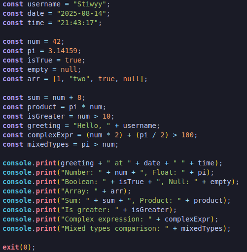

# Skibidi++ Language Support


VS Code extension providing syntax highlighting for the Skibidi++ programming language.

## Features

-   Syntax highlighting for Skibidi++ (`.spp`) files
-   Custom Tokyo Night-inspired color theme optimized for Skibidi++
-   Recognizes language constructs:
    -   Keywords and declarations (`const`, `let`, `var`, etc.)
    -   Built-in functions (`print`, `exit`)
    -   Special objects (`console`)
    -   Strings, numbers, booleans, and null values
    -   Operators and expressions



## Usage

1. Open or create a file with the `.spp` extension
2. VS Code will automatically detect it as a Skibidi++ file
3. For the best experience, select the included theme:
    - Press `Ctrl+K Ctrl+T` or go to File → Preferences → Color Theme
    - Select "Skibidi++ Theme"

## Example

```skibidipp
const username = "Stiwyy";
const date = "2025-08-14";
const time = "22:26:30";

const num = 42;
const pi = 3.14159;
const isTrue = true;
const empty = null;

console.print("Hello, " + username + " at " + date + " " + time);
console.print("Number: " + num + ", Float: " + pi);

exit(0);
```

## Color Theme

The extension includes a custom Tokyo Night-inspired theme with colors specifically chosen for Skibidi++:

-   **Keywords** (if, else, while, for): Purple
-   **Declarations** (const, let, var): Purple
-   **Strings**: Green
-   **Numbers, Booleans, null**: Orange
-   **Built-in Functions** (exit, print): Pink
-   **Special Objects** (console): Turquoise
-   **Variables**: Light blue
-   **Operators**: Light blue

## Requirements

-   VS Code 1.60.0 or higher

## License

MIT

## Author

[Stiwyy](https://github.com/Stiwyy)

---
